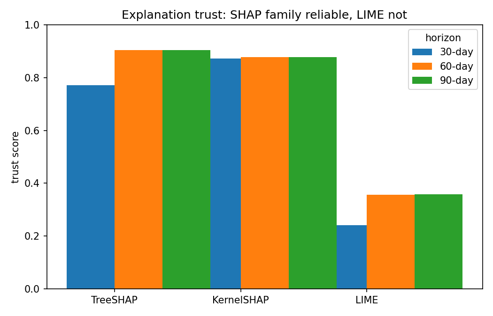
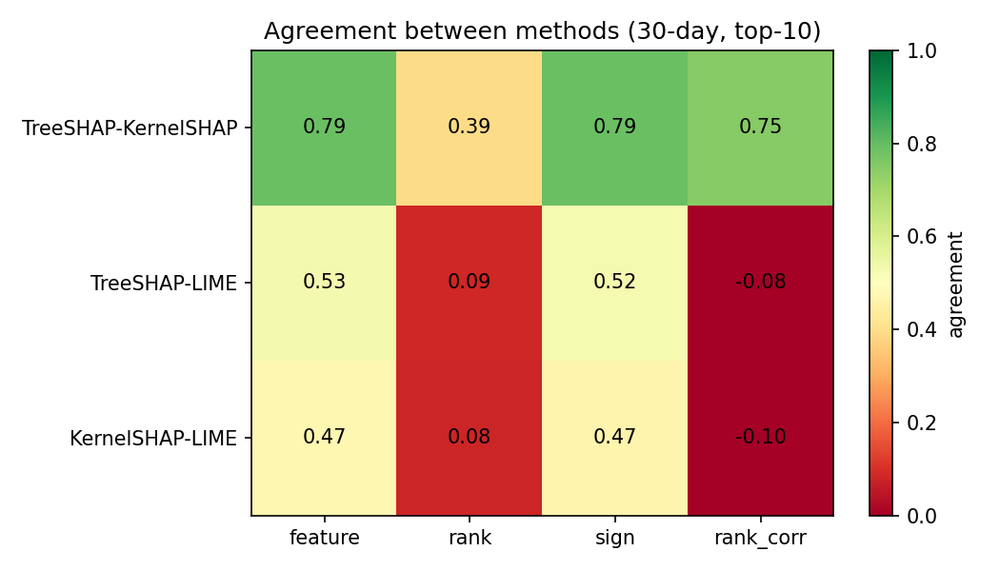
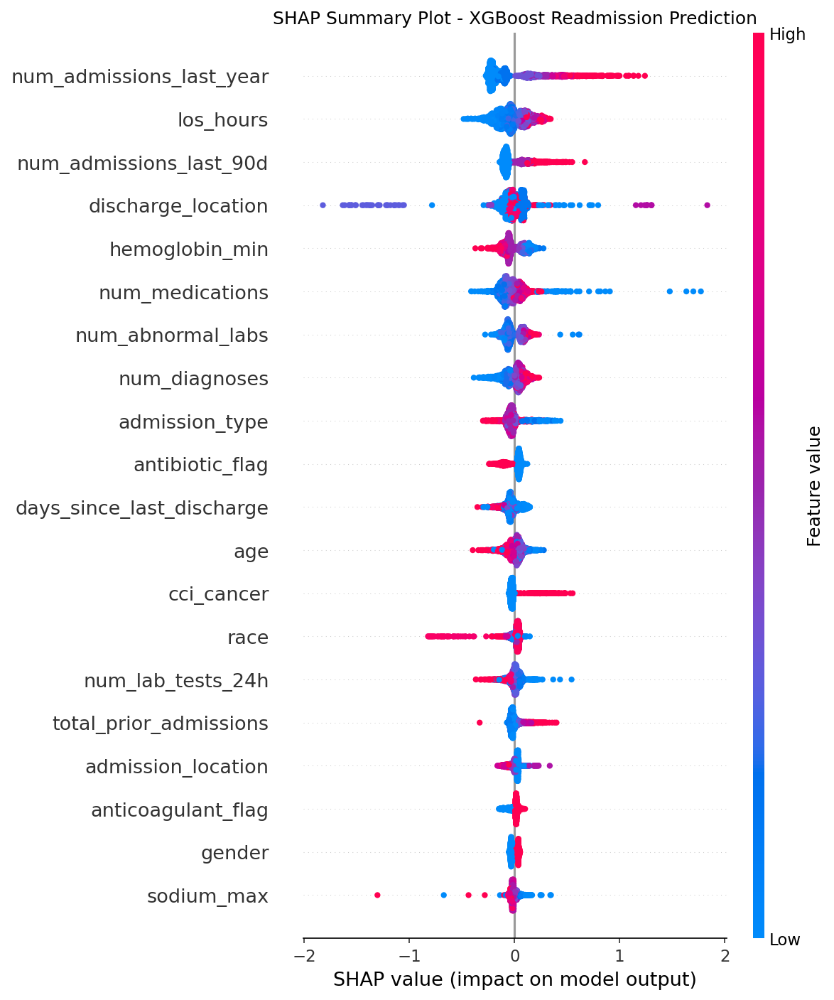
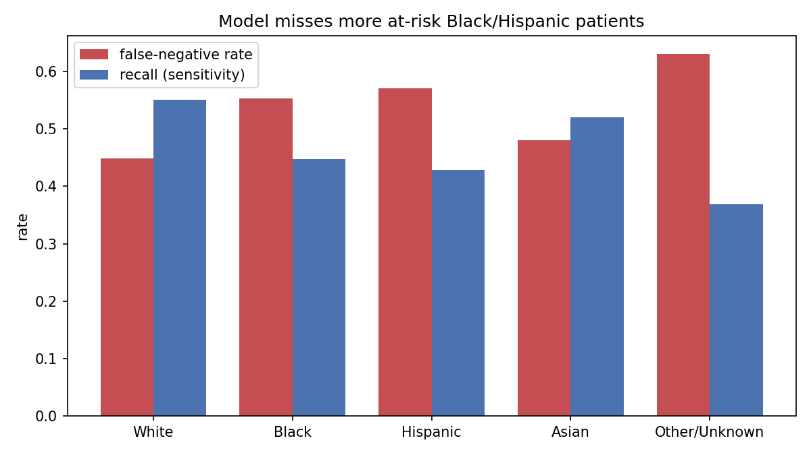

# A Validation Framework for Trustworthy Explanations of Hospital Readmission Prediction on MIMIC-IV


**When SHAP, LIME and Integrated Gradients disagree about why a patient is high-risk, which explanation should a clinician trust?**

This project builds readmission models on **406,031 admissions from 180,352 patients** (MIMIC-IV v3.1), shows that structured EHR data hits a performance ceiling, and then contributes a **three-axis trust framework** (fidelity, clinical plausibility, cross-method disagreement) plus a **subgroup fairness audit** to decide which explanations and fairness claims can be relied on.

MSc in Computing (Data Analytics), Dublin City University. Authors: **Niket Ahire** and **Robert Borkar**.

---

## Key findings

| # | Research question | Finding |
|---|---|---|
| **RQ1** | Does changing *what* we predict (if vs. when a patient returns) raise the ceiling? | **No.** Four independent approaches (visit-level gradient boosting, patient-level classification, incremental-history LSTM, survival analysis) all converge on **AUROC ≈ 0.68–0.74**. This is a data ceiling, not a modelling failure. |
| **RQ2** | When explainers disagree, which one is trustworthy? | **SHAP.** TreeSHAP and KernelSHAP are faithful (faithfulness corr. 0.79 / 0.74) and clinically well-signed (trust 0.77–0.91). **LIME fails both** (faithfulness 0.48, sign agreement 0.00 at K=10, trust 0.24–0.36) and its rank correlation with SHAP is *negative*. |
| **RQ3** | Are prediction errors distributed fairly? | **No.** Race adds almost nothing to discrimination (ΔAUROC +0.003), yet false-negative rate is **0.45 for White vs. 0.55 for Black and 0.57 for Hispanic** patients with near-identical base rates: a measurable equal-opportunity gap. |

---

## Pipeline

```
MIMIC-IV v3.1 cohort (406k admissions, 180k patients, 45 features)
        │
        ├── Visit-level (406k)   : LR / XGBoost / LightGBM / Attention-LSTM → 30/60/90-day readmission
        └── Patient-level (180k) : within-window XGBoost, incremental LSTM, survival (Cox, Kaplan–Meier)
                         │
                   Selected model: XGBoost
                         │
        ┌────────────────┴────────────────┐
  Trust framework (contribution)     Fairness audit
  TreeSHAP · KernelSHAP · LIME       FPR / FNR / recall by race
  (+ Integrated Gradients on BiLSTM) with/without-race ablation
  Fidelity + Plausibility + Disagreement
```

---

## The trust framework

Every method is scored on the same persisted sample of 2,000 test instances, at read depths K ∈ {5, 10, 15} and horizons H ∈ {30, 60, 90} days.

| Axis | Question | How it's measured |
|---|---|---|
| **A. Fidelity** | Does the explanation reflect what the model actually computes? | Quantus faithfulness correlation and sparseness, versus a random-attribution baseline |
| **B. Plausibility** | Does it highlight the features clinical evidence says matter, with the right sign? | Feature and sign agreement against a literature-derived reference set of 11 high-tier features, fixed **before** looking at any attribution |
| **C. Disagreement** | Do the methods agree with each other? | Krishna et al. feature / rank / sign agreement and rank correlation; TreeSHAP–KernelSHAP serves as a positive control |

**Trust = ½ (Fidelity + SignAgreement<sub>K=10</sub>)**

| Method | Trust (H=30) | Trust (H=60) | Trust (H=90) |
|---|---|---|---|
| TreeSHAP | 0.77 | **0.91** | **0.91** |
| KernelSHAP | **0.87** | 0.88 | 0.88 |
| LIME | 0.24 | 0.36 | 0.36 |

<p align="center">
  
  
</p>

---

## Results

### Predictive performance (test set)

| Framing | Window | Acc. | Prec. | Rec. | F1 | AUROC |
|---|---|---|---|---|---|---|
| Visit | 30d | 0.69 | 0.31 | 0.61 | 0.41 | **0.72** |
| Visit | 60d | 0.66 | 0.39 | 0.68 | 0.50 | **0.73** |
| Visit | 90d | 0.65 | 0.44 | 0.73 | 0.55 | **0.74** |
| Patient | 30d | 0.74 | 0.22 | 0.47 | 0.30 | 0.68 |
| Patient | 60d | 0.69 | 0.27 | 0.57 | 0.36 | 0.69 |
| Patient | 90d | 0.68 | 0.30 | 0.58 | 0.39 | 0.70 |

- The incremental-history LSTM rises only from 0.65 to 0.67 over the first four visits and never beats XGBoost.
- Cox survival model C-index: 0.607. Exact days-to-return regression fails (MAE 550 days), which we report as a negative result.
- Isotonic calibration fixes the XGBoost model's overconfidence at almost no ranking cost (AUROC 0.7183 → 0.7179).

### What drives readmission (trusted SHAP explanation)

Prior admissions in the last year, length of stay, admissions in the last 90 days, discharge location, minimum haemoglobin, medication count, abnormal lab count and number of diagnoses. All are clinically sensible and consistent with the reference set.

<p align="center">
  
</p>

### Fairness (30-day model)

| Group | n | Base rate | Recall | FNR | Selection rate |
|---|---|---|---|---|---|
| White | 23,775 | 0.13 | 0.55 | 0.45 | 0.34 |
| Black | 4,643 | 0.13 | 0.45 | **0.55** | 0.25 |
| Hispanic | 1,853 | 0.11 | 0.43 | **0.57** | 0.23 |
| Asian | 1,500 | 0.12 | 0.52 | 0.48 | 0.27 |

An exploratory FairGBM constraint on **age** narrowed the age FNR gap (+0.106 → +0.079) at negligible AUROC cost (−0.0005), but had mixed effects on race subgroups.

<p align="center">
  
</p>

---

## Repository structure

| Folder / notebook | Purpose |
|---|---|
| `01`–`02` | Cohort loading, chronological split, EDA |
| `03`, `04`, `06`, `10` | Logistic regression, XGBoost tuning, LightGBM, final XGBoost |
| `05_lstm_attention/` | Attention-LSTM (visit level) |
| `07_shap_analysis/` | TreeSHAP, KernelSHAP, calibration, subgroup plots |
| `08_fairness_mitigation.ipynb` | FairGBM constrained variant |
| `09_lime_analysis.ipynb` | LIME |
| `11_integrated_gradients_bilstm/` | Integrated Gradients on a BiLSTM, compared with SHAP |
| `12_trust_framework/` | **Trust framework**: fidelity, plausibility, disagreement across horizons |
| `13_trust_framework_figures/` | Scorecard and heatmap figures |
| `14_tsne_patient_maps.ipynb` | t-SNE patient maps |
| `15_patient_dataset/` → `16_patient_models/` | Patient-level dataset and models |
| `17_lstm_incremental/` | Incremental-history LSTM |
| `18_visit_baseline_metrics/` | Full metric suite for visit-level models |
| `19_patient_shap/` | SHAP on the patient-level model |
| `20_fairness_audit/` | Race fairness audit and ablation |
| `21_survival_analysis/` | Kaplan–Meier and Cox models |

See [`INDEX.md`](INDEX.md) for the detailed reading order and [`NB11_framework_spec.md`](NB11_framework_spec.md) for the framework specification.

---

## Setup and reproducibility

**Primary model:** XGBoost (`n_estimators=500`, `max_depth=5`, `learning_rate=0.05`, `subsample=0.8`, `colsample_bytree=0.8`, `reg_lambda=2`, `reg_alpha=0.1`, `min_child_weight=5`, `tree_method=hist`). Class imbalance is handled with `scale_pos_weight`, the threshold is tuned on out-of-fold CV predictions, and the seed is 42.

**Splits:**
- Visit level: chronological 70/15/15 split with an assertion guaranteeing no train/test patient overlap. This fixed an earlier leakage bug that had inflated AUROC to about 0.79.
- Patient level: 80/20 split by patient ID, then 5-fold stratified CV.

**Software:** Python, pandas, scikit-learn 1.6.1, XGBoost 3.3.0, LightGBM, FairGBM 0.9.14, TensorFlow 2.20.0, SHAP 0.52.0, LIME 0.2.0.1, Quantus, lifelines, Google BigQuery.

```bash
pip install pandas numpy scikit-learn xgboost lightgbm tensorflow shap lime quantus lifelines matplotlib seaborn
```

## Data access

This project uses [MIMIC-IV v3.1](https://physionet.org/content/mimiciv/), which requires credentialed PhysioNet access and a signed data use agreement. **No MIMIC data is included in this repository.** Notebook outputs showing patient-level rows have been cleared, and per-patient attribution arrays and trained model weights are excluded. To reproduce the results, obtain MIMIC-IV access and build the cohort through BigQuery.

## Limitations

The cohort comes from a single site. The clinical reference set is derived from the literature without clinician review. Race categories are broad administrative groupings. Fairness mitigation for race is left for future work.

## Authors

- **Niket Ahire**: [LinkedIn](https://www.linkedin.com/in/niket-ahire-512178291) · [GitHub](https://github.com/ahireniket33)
- **Robert Borkar**

School of Computing, Dublin City University.
